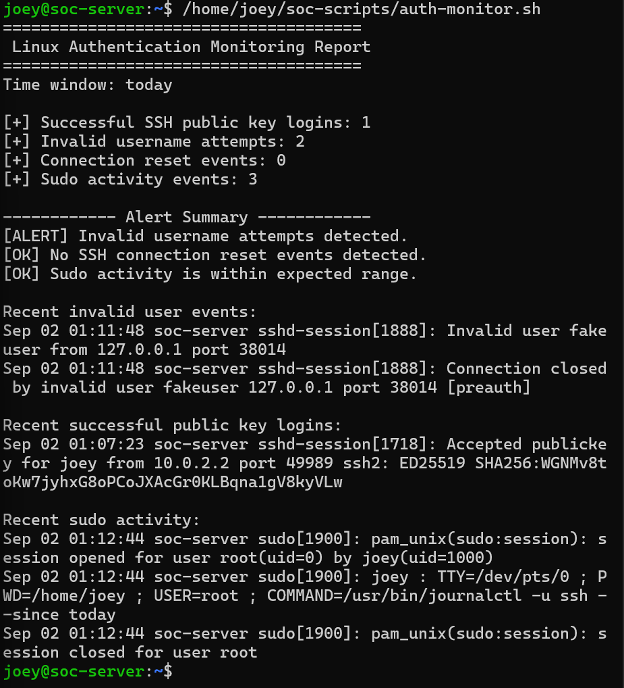
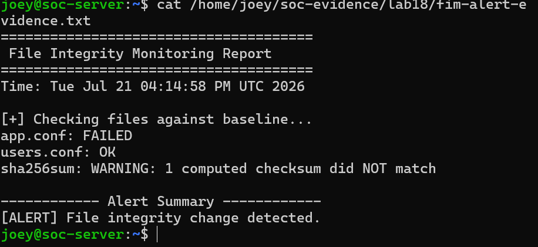
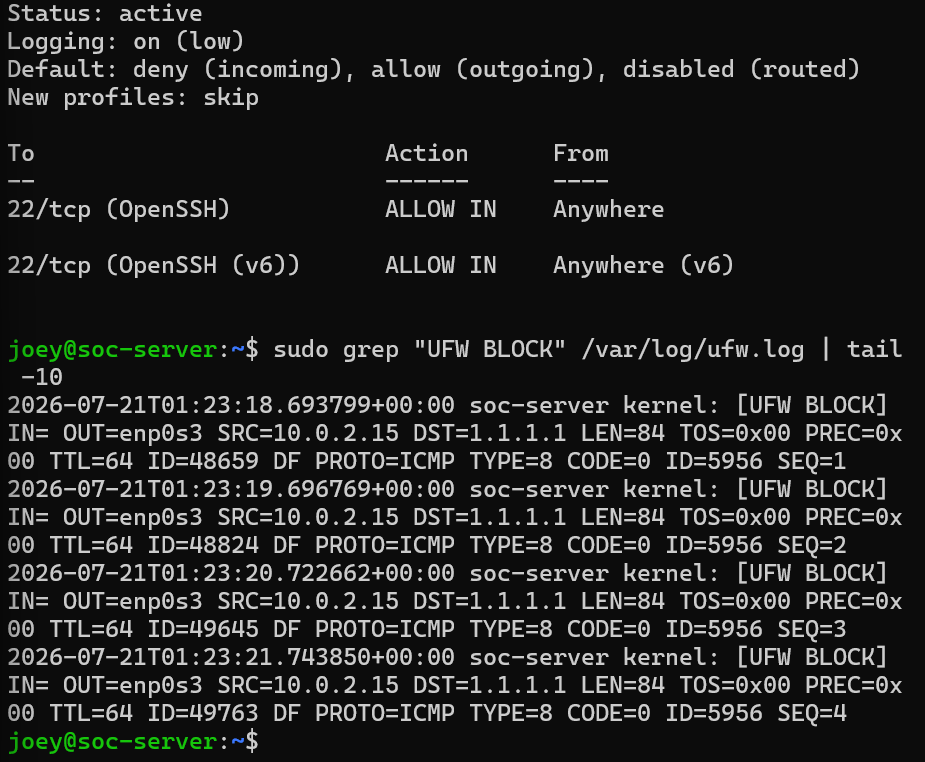
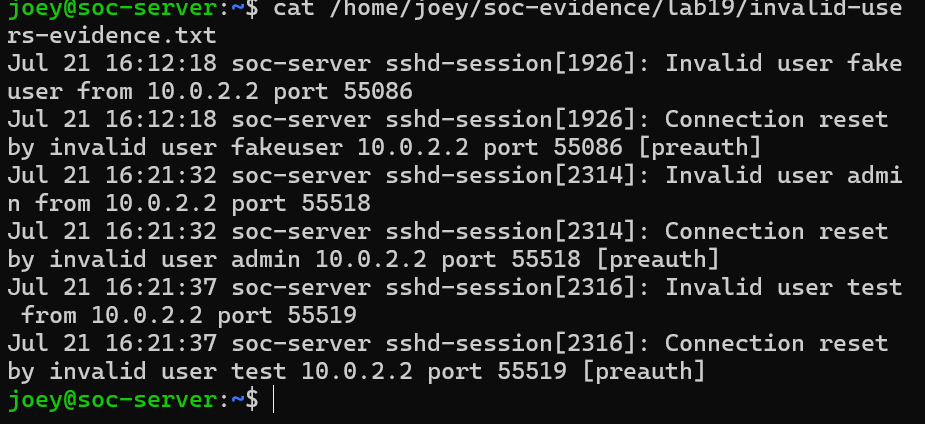
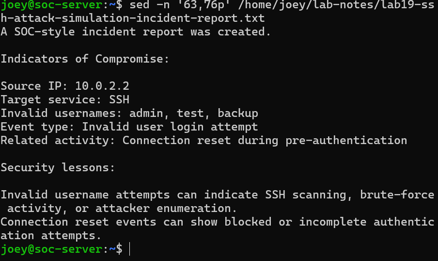

# Home SOC Cybersecurity Lab

A Linux-based Security Operations Center (SOC) environment focused on security monitoring, detection engineering, system hardening, and incident investigation.

The environment was used to harden SSH access, monitor authentication activity, analyze Linux security logs, detect file integrity changes, automate security monitoring with Bash and cron, inspect audit events, generate controlled attack activity, collect forensic evidence, and produce a SOC-style incident report.

## Key Security Outcomes

- Built a Bash-based authentication detection script for suspicious SSH and sudo activity
- Automated security monitoring and reporting with cron
- Hardened SSH using key-based authentication and disabled password-based login
- Configured UFW firewall controls and investigated blocked network traffic
- Implemented File Integrity Monitoring (FIM) using SHA-256 baselines
- Used `auditd` to monitor security-relevant file activity
- Generated and investigated controlled authentication attacks
- Collected security evidence and documented findings in a SOC-style incident report
- Performed local Wazuh agent inspection and troubleshooting

## Investigation Highlight

A controlled SSH attack simulation generated invalid-user authentication activity against the Linux server. Authentication logs were investigated to identify the source, targeted service, attempted usernames, and associated pre-authentication events.

The investigation produced indicators including:

| Indicator | Observed Value |
|---|---|
| Target Service | SSH |
| Invalid Usernames | `admin`, `test`, `backup` |
| Activity | Invalid user authentication attempts |
| Related Event | Connection reset during pre-authentication |

The resulting evidence was preserved and documented in a SOC-style incident report containing findings, impact assessment, response actions, and recommendations.

## Technology Stack

`Ubuntu Server` · `Linux` · `SSH` · `UFW` · `Bash` · `auditd` · `cron` · `journalctl` · `Wazuh` · `VirtualBox` · `GitHub`

---

## Project Goals

---

## Project Goals

The goals of this project are to:

- Build a cybersecurity lab from scratch
- Learn Linux fundamentals
- Practice system hardening
- Monitor authentication activity
- Investigate logs using command-line tools
- Write basic detection scripts
- Collect security evidence
- Create SOC-style incident documentation
- Build a public cybersecurity portfolio

---

## Lab Environment

| Component | Description |
|---|---|
| Host Machine | Windows laptop |
| Virtualization | VirtualBox |
| Main VM | Ubuntu Server |
| Remote Access | SSH key authentication |
| Firewall | UFW |
| Logs | journalctl, /var/log |
| Monitoring | Bash scripts, auditd, Wazuh agent inspection |
| Documentation | GitHub |

---

## Skills Demonstrated

This project demonstrates practical skills in:

- Linux command-line navigation
- File and directory permissions
- User and group analysis
- Service and process inspection
- Network troubleshooting
- SSH configuration and hardening
- Firewall configuration and logging
- Authentication monitoring
- Log filtering with grep
- Scheduled monitoring with cron
- Bash scripting
- File Integrity Monitoring
- Linux auditing with auditd
- Security alert generation
- Evidence collection
- Incident report writing

---

## Tools and Commands Used

| Tool / Command | Purpose |
|---|---|
| `ssh` | Secure remote access |
| `systemctl` | Service management |
| `journalctl` | Log investigation |
| `grep` | Log filtering |
| `ss` | Port and connection inspection |
| `ip` | Network configuration review |
| `ping` | Connectivity testing |
| `ufw` | Firewall management |
| `chmod` | Permission changes |
| `auditd` | Linux auditing |
| `auditctl` | Audit rule management |
| `ausearch` | Audit log searching |
| `aureport` | Audit reporting |
| `sha256sum` | File integrity hashing |
| `cron` | Scheduled task automation |
| `bash` | Scripting |

---

## Completed Labs

| Lab | Title | Focus |
|---:|---|---|
| 01 | VirtualBox and CyberLab Setup | Lab environment setup |
| 02 | Ubuntu Server Installation and Baseline | Ubuntu installation and baseline checks |
| 03 | Linux Filesystem and Logs | Filesystem navigation and log review |
| 04 | Linux Users, Groups, and Permissions | Account and permission analysis |
| 05 | Linux Processes and Services | Process and service inspection |
| 06 | Linux Networking Basics | IP, routes, DNS, ports, and connections |
| 07 | Linux Hardening Basics | UFW firewall and SSH review |
| 08 | SSH Key Authentication | Public/private key authentication |
| 09 | SSH Hardening: Disable Password Login | Safer SSH configuration |
| 10 | Linux Authentication Monitoring | SSH and sudo log monitoring |
| 11 | Linux Log Investigation | journalctl, grep, time filters, event counting |
| 12 | UFW Firewall Logging | Firewall logging and blocked traffic analysis |
| 13 | Failed Login Detection Script | Bash detection script |
| 14 | Cron Jobs and Scheduled Monitoring | Scheduled security monitoring |
| 15 | Linux Audit Basics with auditd | File auditing and audit log investigation |
| 16 | File Integrity Monitoring | SHA-256 baseline and change detection |
| 17 | Wazuh Agent Local Inspection | Agent installation and troubleshooting |
| 18 | Security Alert Generation and Evidence Collection | Alert generation and evidence preservation |
| 19 | SSH Attack Simulation and Incident Report | Controlled attack simulation and SOC report |
| 20 | Portfolio Polish and Final README | Project organization and final presentation |

---

## Featured Security Workflows

### Authentication Detection

A Bash-based monitoring script analyzes Linux authentication telemetry and generates an alert when suspicious SSH activity is detected.



The detection identified invalid username activity in the SSH logs and surfaced the associated events for analyst review.

---

### SSH Hardening

I configured SSH key authentication and disabled password-based SSH login after verifying key login worked safely.

Key results:

- SSH key login worked successfully
- Password-only login failed
- Root password login was restricted
- SSH logs confirmed public key authentication

---

### Authentication Monitoring

I monitored SSH and sudo activity using `journalctl` and `grep`.

Events detected:

- Successful SSH public key logins
- Invalid username attempts
- Connection reset events
- Sudo/admin activity

---

### Detection Scripting

I created a Bash authentication monitoring script that counts important SSH and sudo events.

The script reports:

- Successful SSH public key logins
- Invalid username attempts
- Connection reset events
- Sudo activity events
- Alert messages for suspicious activity

---

### Scheduled Monitoring

I scheduled the authentication monitoring script with cron so it runs automatically every 5 minutes and saves output to a report file.

Cron job used:

```cron
*/5 * * * * /home/joey/soc-scripts/auth-monitor.sh > /home/joey/soc-reports/auth-report-cron.txt 2>&1
```

---

### File Integrity Monitoring

I created a File Integrity Monitoring lab using SHA-256 hashes.

FIM stands for **File Integrity Monitoring**.

The lab detected when a monitored configuration file changed from:

```text
admin_login=false
```

to:

```text
admin_login=true
```

The script generated:

```text
[ALERT] File integrity change detected.
```


The integrity check detected that `app.conf` no longer matched its SHA-256 baseline while `users.conf` remained unchanged, generating a file integrity alert for analyst review.
---

### Linux Auditing

I installed and used `auditd`, the Linux Audit Daemon, to monitor file activity.

I created an audit rule to monitor:

```text
/home/joey/audit-lab/important.conf
```

The rule tracked:

- Read events
- Write events
- Execute events
- Attribute changes

---

### Firewall Logging

I enabled UFW firewall logging and created a controlled blocked traffic event.

UFW stands for **Uncomplicated Firewall**.

I blocked outbound ICMP traffic to:

```text
1.1.1.1
```

ICMP stands for **Internet Control Message Protocol**.

The firewall logs showed fields such as:

- Source IP
- Destination IP
- Protocol
- ICMP type
- Time To Live
- Packet length



The captured UFW logs show blocked ICMP traffic from the Ubuntu server (`10.0.2.15`) to `1.1.1.1`, including source, destination, protocol, ICMP type, packet length, and other network metadata.

---

### Incident Report

I simulated an SSH invalid username attack using usernames such as:

```text
admin
test
backup
```


The investigation identified repeated invalid-user authentication attempts originating from `10.0.2.2`, targeting multiple usernames and generating associated pre-authentication connection-reset events.

I collected evidence, counted events, identified indicators of compromise, and wrote a SOC-style incident report.

IoC stands for **Indicator of Compromise**.

Example indicators:

| Indicator | Value |
|---|---|
| Source IP | `10.0.2.2` |
| Target Service | SSH |
| Invalid Usernames | `admin`, `test`, `backup` |
| Activity | Invalid user login attempts |
| Related Event | Connection reset during pre-authentication |



The final incident documentation consolidated the investigation findings into analyst-ready indicators, including the source IP, targeted service, attempted usernames, event type, and related pre-authentication activity.

#### MITRE ATT&CK Mapping

The simulated SSH activity was mapped to MITRE ATT&CK based on the behavior directly supported by the collected telemetry.

| Observed Behavior | Tactic | Technique | Technique ID | Confidence |
|---|---|---|---|---|
| SSH remote access activity | Lateral Movement | SSH | `T1021.004` | HIGH |
| Repeated invalid-user authentication attempts | Credential Access | Password Guessing | `T1110.001` | LOW / POSSIBLE |

**Mapping rationale:**

- **T1021.004 — SSH:** The collected telemetry directly shows repeated SSH connection attempts against the Ubuntu server, making the SSH technique mapping strongly supported.
- **T1110.001 — Password Guessing:** The repeated invalid-user attempts are consistent with password-guessing behavior; however, password authentication was disabled on the server. The available telemetry confirms username enumeration/authentication attempts but does not directly demonstrate passwords being guessed. This mapping is therefore treated as possible rather than confirmed.

This confidence-based approach avoids overstating what the available telemetry proves and distinguishes directly observed behavior from analyst interpretation.

---

## Key Security Lessons

- SSH should be hardened with key-based authentication.
- Password authentication should only be disabled after SSH keys are tested.
- Logs are critical for detecting suspicious activity.
- Invalid usernames may indicate scanning or brute-force attempts.
- Sudo activity should be reviewed because it shows privileged commands.
- Firewall logs help identify blocked network behavior.
- File integrity monitoring can detect unauthorized file changes.
- auditd can monitor sensitive files and system activity.
- Detection scripts help turn raw logs into useful alerts.
- Evidence should be saved before writing incident reports.
- Incident reports should include findings, evidence, impact, response actions, and recommendations.

---

## Interview Summary

I built a hands-on Home SOC cybersecurity lab using Ubuntu Server, VirtualBox, SSH, UFW, auditd, Bash scripting, cron, and GitHub. I hardened SSH, enabled firewall logging, monitored authentication activity, wrote detection scripts, scheduled automated reports, created file integrity monitoring checks, inspected Wazuh agent behavior, generated controlled security alerts, collected evidence, and wrote a SOC-style incident report.

This project demonstrates practical entry-level cybersecurity skills in Linux administration, security monitoring, log analysis, detection engineering, and incident response documentation.

---

## Next Steps

Future improvements may include:

- Add screenshots to each lab
- Add a network diagram
- Add Splunk or Wazuh manager when hardware allows
- Add Windows Event Viewer labs later
- Add more detection scripts
- Add MITRE ATT&CK mapping
- Create a final portfolio summary for LinkedIn
